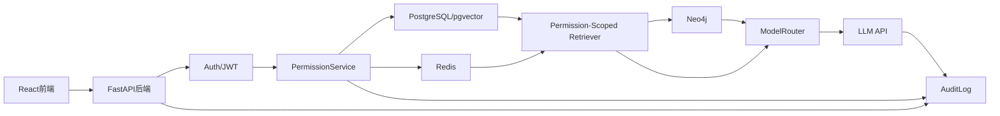
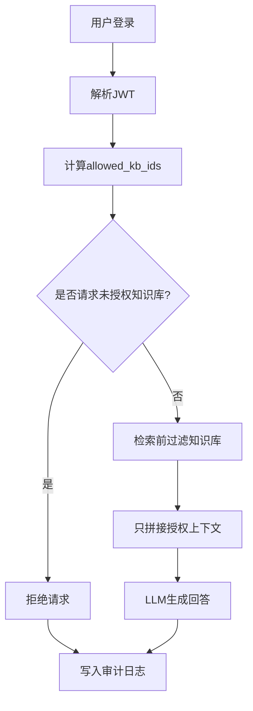

# Permission-Aware Enterprise GraphRAG Assistant

企业级权限感知GraphRAG知识问答系统。

> 当前项目处于文档先行和MVP骨架阶段。目标不是做一个前端Demo，而是逐步交付一个具备真实鉴权、RBAC、权限内RAG/GraphRAG、缓存防越权和审计能力的企业级AI应用样板。

## 项目目标

本项目用于展示从0到1设计和实现企业内部知识库问答系统的能力，重点覆盖：

- 企业内部知识库问答系统设计。
- 用户鉴权、RBAC权限控制和越权访问拦截。
- 权限感知RAG/GraphRAG，而不是普通聊天机器人。
- 前后端API设计、数据库建模、缓存层设计。
- 本地轻量模型和高参数API模型的职责拆分。
- Docker、本地启动、分阶段Git提交和GitHub项目展示。

## 核心业务场景

系统模拟一个企业内部知识库。用户登录后，只能访问自己角色和部门被授权的知识库。用户提问时，后端必须先完成确定性权限判断，再进入RAG或GraphRAG检索链路。

典型越权案例：

- `visitor` 询问 visitor-safe 公共制度：只允许检索 `public-policy`。
- `visitor` 询问财务薪酬制度：直接拒绝，不检索未授权知识库，不调用大模型生成答案。
- `cn_staff` 询问中文制度：只在 `cn-public`、`cn-internal` 内检索。
- `en_staff` 询问英文制度：只在 `en-public`、`en-internal` 内检索。
- `bilingual_admin` 可访问中英文部门知识库和 `public-policy`，并可查看审计日志。

## 用户角色

| 角色 | 说明 | 默认访问范围 |
| --- | --- | --- |
| `bilingual_admin` | 双语管理员 | `cn-public`、`cn-internal`、`en-public`、`en-internal`、`public-policy` |
| `cn_staff` | 中文部门员工 | `cn-public`、`cn-internal` |
| `en_staff` | 英文部门员工 | `en-public`、`en-internal` |
| `visitor` | 访客 | `public-policy` |

## v0.1.6 双语部门知识隔离

新增演示目标：在 RBAC 之外，展示“部门 + 语言知识库边界”隔离。

- `cn_staff` 只能访问中文知识库：`cn-public`、`cn-internal`。
- `en_staff` 只能访问英文知识库：`en-public`、`en-internal`。
- `bilingual_admin` 同时访问中英文知识库与 `public-policy`。
- `visitor` 仅访问 `public-policy`。

知识库内容均为虚构文档：

- `cn-public`、`cn-internal`：仅中文内容。
- `en-public`、`en-internal`：仅英文内容。
- `public-policy`：仅 visitor-safe 公共信息，不含薪酬、工资、定价、财务敏感词。

## 核心功能列表

- 用户登录和JWT鉴权。
- RBAC角色和部门权限判断。
- 知识库ACL控制。
- 提问前计算 `allowed_kb_ids`。
- RAG检索前过滤未授权知识库。
- GraphRAG只扩展授权文档和授权知识库范围内的图谱关系。
- Redis缓存key绑定用户、角色、部门、权限范围、问题、知识库版本和模型配置。
- 所有问答请求写入审计日志。
- 越权访问演示用例。
- 本地轻量模型路由接口预留。
- OpenAI-compatible高参数模型接口预留。
- 示例数据全部为虚构企业文档。

## 技术栈

| 层级 | 技术 |
| --- | --- |
| 前端 | React + Vite + TypeScript + TailwindCSS |
| 后端 | FastAPI + Pydantic + SQLAlchemy 2.x + Alembic |
| 主数据库 | PostgreSQL |
| 向量检索 | pgvector |
| 图数据库 | Neo4j |
| 缓存 | Redis |
| 鉴权 | JWT + RBAC + Department ACL |
| 本地轻量模型 | Qwen0.5B接口预留，MVP可用规则路由 |
| 高参数模型 | OpenAI-compatible API |
| 部署 | Docker Compose，本地优先 |

## 系统架构图



## 权限控制流程图



## RAG防越权流程说明

权限控制不能交给大模型。后端必须在检索前完成确定性过滤：

1. 从JWT解析用户身份。
2. 根据角色、部门、知识库ACL计算 `allowed_kb_ids`。
3. 如果用户指定了知识库范围，先校验指定范围是否属于 `allowed_kb_ids`。
4. pgvector检索SQL必须包含 `WHERE knowledge_base_id IN (:allowed_kb_ids)`。
5. GraphRAG扩展时只能基于授权chunk、授权document、授权knowledge_base继续查询。
6. PromptBuilder只能拼接授权上下文。
7. 返回答案前再次校验命中文档是否都属于授权范围。
8. 审计日志记录用户、问题、拒绝状态、命中知识库、命中文档、缓存命中和模型信息。

## Redis防缓存越权设计

禁止使用只按问题文本生成的全局缓存key。推荐缓存key结构：

```text
qa:v1:{user_id}:{role}:{department}:{permission_scope_hash}:{kb_version_hash}:{question_hash}:{mode}:{model_profile}:{prompt_version}
```

设计原则：

- `user_id`、`role`、`department` 进入key，避免不同用户共享敏感答案。
- `permission_scope_hash` 来源于排序后的授权知识库、权限级别和权限策略版本。
- `kb_version_hash` 来源于授权知识库版本，知识库更新后自然失效。
- `question_hash` 保存问题摘要，不把敏感问题原文写入key。
- `model_profile` 和 `prompt_version` 进入key，避免模型或提示词升级后复用旧答案。
- 缓存命中也必须写入审计日志。
- 拒绝结果可以短TTL缓存，但仍要保留完整审计记录。

## 本地轻量模型和高参数API模型分工

| 模块 | 职责 | 是否允许决定权限 |
| --- | --- | --- |
| `LocalModelRouter` | 意图识别、目标部门判断、是否需要RAG、是否需要GraphRAG | 否 |
| `RuleBasedLocalModelRouter` | MVP阶段用规则模拟本地小模型 | 否 |
| `OllamaQwenRouter` | 后续接入本地Qwen0.5B或同类轻量模型 | 否 |
| `LLMClient` | 最终答案生成、复杂总结、引用整合 | 否 |
| `PermissionService` | 角色、部门、知识库ACL和授权范围计算 | 是，唯一权限来源 |

## API接口概览

| 方法 | 路径 | 说明 |
| --- | --- | --- |
| `POST` | `/api/v1/auth/login` | 用户登录，返回JWT |
| `GET` | `/api/v1/auth/me` | 当前用户、角色、部门和权限摘要 |
| `GET` | `/api/v1/knowledge-bases` | 当前用户可访问知识库列表 |
| `POST` | `/api/v1/qa/ask` | 提问，支持 `auto`、`rag`、`graphrag` |
| `GET` | `/api/v1/qa/{request_id}` | 查看单次问答详情 |
| `GET` | `/api/v1/admin/users` | 管理员查看用户 |
| `POST` | `/api/v1/admin/knowledge-bases` | 管理员创建知识库 |
| `POST` | `/api/v1/admin/documents` | 管理员录入虚构文档 |
| `GET` | `/api/v1/admin/audit-logs` | 管理员查看审计日志 |
| `GET` | `/api/v1/demo/overreach-cases` | 查看预设越权演示案例 |

## 数据库设计概览

PostgreSQL保存权限事实、业务数据、文档chunk和审计日志：

- `users`
- `roles`
- `departments`
- `permissions`
- `role_permissions`
- `knowledge_bases`
- `knowledge_base_acl`
- `documents`
- `document_chunks`
- `qa_audit_logs`
- `ingestion_jobs`

Neo4j保存知识图谱关系：

- 节点：`Department`、`KnowledgeBase`、`Document`、`Chunk`、`Entity`
- 关系：`OWNS_KB`、`HAS_DOCUMENT`、`HAS_CHUNK`、`MENTIONS`、`RELATED_TO`

## 分阶段开发计划

| 阶段 | 目标 | 可展示结果 |
| --- | --- | --- |
| Phase 0 | 文档、目录、配置、Docker草案 | GitHub项目结构和架构说明 |
| Phase 1 | 登录、JWT、RBAC、种子用户和知识库 | 不同角色看到不同知识库 |
| Phase 2 | pgvector文档检索、权限内RAG、审计日志 | visitor访问财务问题被拒绝 |
| Phase 3 | Redis权限感知缓存 | 同问题不同权限不串缓存 |
| Phase 4 | Neo4j GraphRAG | 展示授权文档的图谱路径 |
| Phase 5 | React前端 | 登录、问答、审计、越权演示页面 |
| Phase 6 | README polish、测试、Docker启动 | 可上传GitHub的完整MVP |

## Git提交规划

建议按阶段提交：

```text
docs: define product architecture and security boundaries
chore: initialize project scaffold and environment examples
feat(api): add auth rbac and demo knowledge base schema
feat(rag): add permission-scoped vector retrieval and audit logs
feat(cache): add permission-aware qa cache keys
feat(graph): add neo4j graph retrieval for authorized documents
feat(web): add login qa audit and overreach demo screens
chore: add docker docs tests and github-ready readme
```

## 快速开始（Docker Compose）

1. 在项目根目录创建本地环境文件：

```powershell
Copy-Item .env.example .env
```

2. 启动全栈服务：

```powershell
Set-Location infra
docker compose up -d --build
```

3. 访问：

- 前端：`http://127.0.0.1:5173`
- 后端 OpenAPI：`http://127.0.0.1:8000/docs`
- Neo4j Browser：`http://127.0.0.1:7474`（默认账号 `neo4j` / `password12345`）

4. 停止服务：

```powershell
Set-Location infra
docker compose down
```

## 本地开发启动（不使用 Docker）

后端：

```powershell
Set-Location services/api
python -m venv .venv
.\.venv\Scripts\Activate.ps1
python -m pip install -r requirements.txt
python main.py
```

前端（新终端）：

```powershell
Set-Location apps/web
npm install
npm run dev
```

## 测试与验证

后端测试：

```powershell
Set-Location services/api
pytest
```

权限矩阵自动化脚本（无需手动复制 token）：

```powershell
Set-Location C:\Users\lovane\Desktop\permission-aware-enterprise-graphrag
python scripts/test_permission_matrix.py --base-url http://127.0.0.1:8000
```

前端构建验证：

```powershell
Set-Location apps/web
npm run build
```

越权演示（visitor 越权访问）：

1. 使用 `visitor@example.local / Passw0rd!123` 登录。
2. 提问：`请提供 finance compensation salary policy`。
3. 预期：后端返回 `denied=true`，并带 `department scope: finance` 拒绝原因。
4. 以 `bilingual_admin@example.local / Passw0rd!123` 登录管理员页面查看审计日志，确认本次请求被记录。

前端演示增强（无需 Swagger 手工授权）：

1. 登录区支持演示账号卡片：`cn_staff/en_staff/bilingual_admin/visitor`。
2. 点击演示账号可一键填充邮箱与默认密码并登录。
3. 提供越权场景按钮：
   - visitor 问 finance 薪酬制度
   - hr 问 finance 预算审批（演示文案）
   - finance 问 tech 发布密钥（演示文案）
   - tech 问 HR 员工档案（演示文案）
4. 页面会展示当前角色、可访问知识库、本次拒绝状态、命中知识库、审计 `request_id`。
5. 页面提示“访问范围由后端 `allowed_kb_ids` 决定，前端不做权限过滤”。

前端中英文 UI 切换：

1. 页面右上角支持 `中文 / English` 切换。
2. 默认语言为中文。
3. 语言选择会保存到 `localStorage`，刷新后保持上次选择。
4. 仅切换前端展示文案，不改变后端权限判断和请求逻辑。

前端视觉重构（控制台风格）：

1. 页面升级为顶部控制台 + 左中右信息布局（登录/场景、提问与响应、权限与审计）。
2. 采用浅色高级灰背景、细边框、大圆角卡片、轻阴影的极简风格。
3. 越权演示入口升级为场景卡片；知识库展示升级为 tag/badge。
4. `denied` 状态提供明确风险提示样式。
5. 不改变任何后端 API、权限判断、RAG/缓存/审计逻辑。

产品化登录体验与主界面重构：

1. 未登录仅显示企业登录页；登录成功后进入主控制台。
2. 登录态持久化到 `localStorage`（token + user），刷新后调用 `/api/v1/auth/me` 自动恢复。
3. 登录后主界面改为企业知识助手聊天布局：左侧展示当前用户、角色、可访问知识库、模型/路由状态和最近会话；中间展示用户问题与助手回答；右侧展示审计详情、命中知识库、`request_id`、越权拦截和缓存命中状态。
4. 聊天历史保存到浏览器 `localStorage`，key 按用户邮箱隔离，例如 `chat_history_cn_staff@example.local`，切换账号不会看到其他账号历史。
5. 提供新建会话、清空当前会话和最近会话切换。
6. 提供 `退出登录` / `Logout`，退出后清理本地登录态并返回登录页，不删除各账号的本地聊天历史。
7. 安全测试场景迁移为右侧折叠面板，默认折叠，不干扰主问答流程。
8. 顶部导航、左侧状态、中间聊天、右侧审计形成产品化信息架构。

前端缓存展示说明：

1. 当前后端已有 `CacheService`，Docker Compose 默认通过 `REDIS_URL=redis://redis:6379/0` 使用 Redis。
2. 如果 Redis 不可用或测试环境使用内存模式，后端会回退到进程内缓存；权限感知 cache key 仍绑定用户、角色、部门、授权范围、问题、模式和模型配置。
3. 前端不伪造缓存能力，只展示 `/api/v1/qa/ask` 和审计详情返回的真实 `cache_hit` 字段，显示为命中或未命中。
4. 当前生成模型仍保持 `LLM_MODE=mock`；缓存展示不代表接入外部 LLM。

普通问候 general fallback：

1. 对“你好 / hello / hi / 早上好 / good morning”等问候语，后端路由直接走 `general`。
2. `general` 模式不进入 RAG 检索（`need_rag=false`，`retrieved_chunks=[]`）。
3. 返回欢迎语并写入审计日志，权限判断仍由后端确定性代码控制。
4. 当前生成模型仍为 `mock`；Ollama 接入留到后续阶段。

## 演示账号（虚构）

| 角色 | 邮箱 | 默认密码 |
| --- | --- | --- |
| bilingual_admin | `bilingual_admin@example.local` | `Passw0rd!123` |
| cn_staff | `cn_staff@example.local` | `Passw0rd!123` |
| en_staff | `en_staff@example.local` | `Passw0rd!123` |
| visitor | `visitor@example.local` | `Passw0rd!123` |

## 模型接入说明（Phase 6）

- `LLM_MODE=mock`：默认离线模式，返回可复现的确定性答案，便于本地演示和测试。
- `LLM_MODE=api`：通过 `LLM_API_BASE_URL` + `LLM_API_KEY` + `LLM_MODEL` 调用 OpenAI-compatible Chat Completions。
- `LOCAL_ROUTER_MODE=rules`：默认规则路由。
- `LOCAL_ROUTER_MODE=ollama`：通过 `LOCAL_ROUTER_BASE_URL` + `LOCAL_ROUTER_MODEL` 调用本地轻量模型（如 Qwen0.5B）。
- 无论 router 或 LLM 模式如何，权限仍由后端 `PermissionService` 决定，模型不参与授权判定。

## Swagger Authorize 说明

- 当前 `POST /api/v1/auth/login` 使用 JSON body（`email/password`）。
- Swagger 的 OAuth2 Password 授权流默认按表单字段（`username/password`）请求 token，因此会出现 `422 Unprocessable Entity`。
- 这不影响常规登录接口、前端登录以及自动化脚本。MVP 演示建议直接使用前端和脚本验证权限矩阵。

## 安全声明

- 不上传真实企业数据。
- 不上传真实用户数据。
- 不上传API Key。
- 不上传 `.env`。
- 所有密钥、数据库地址、模型配置都通过环境变量传入。
- `.env.example` 只提供示例变量，不包含真实凭据。
