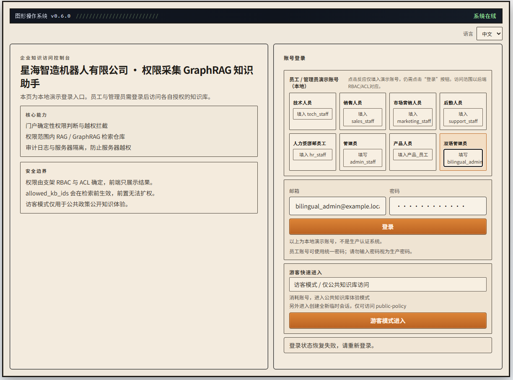
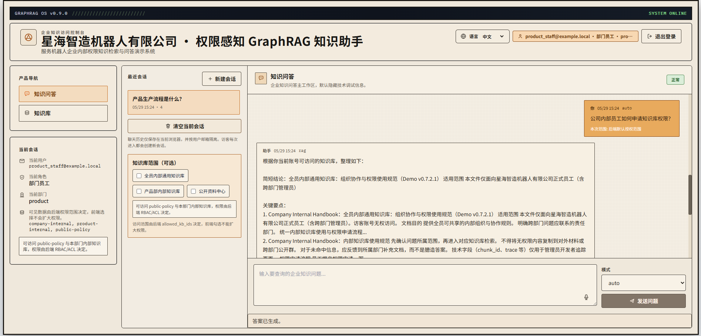
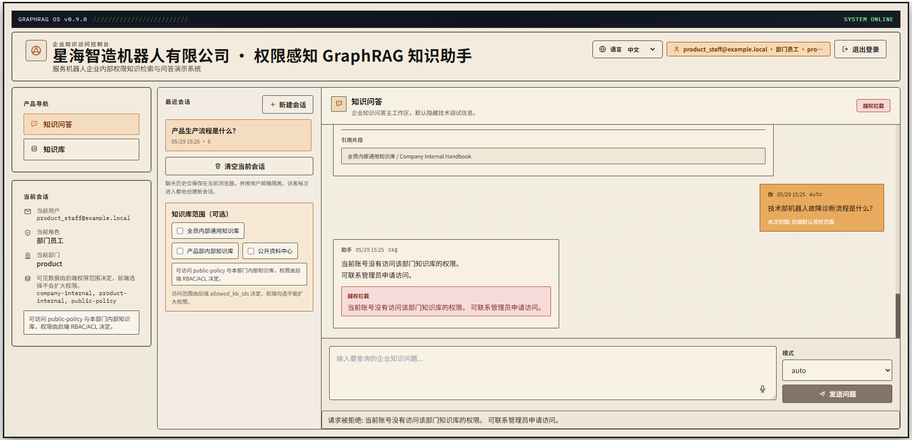
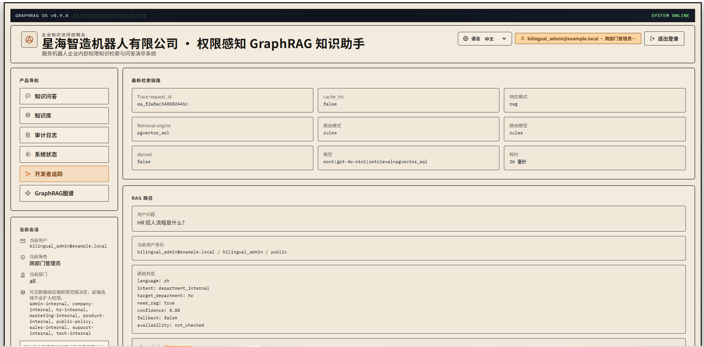
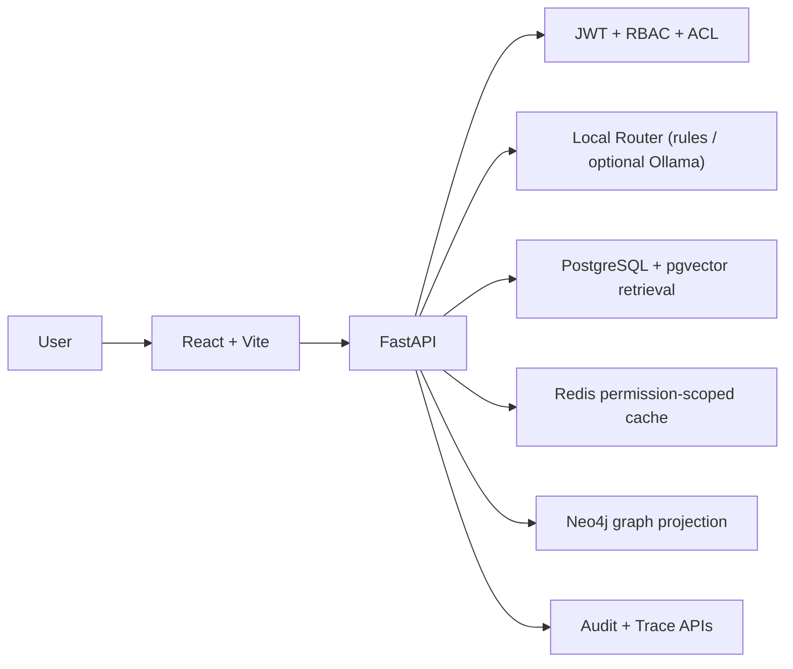

# Permission-Aware Enterprise GraphRAG

[](https://github.com/jimzhou03/permission-aware-enterprise-graphrag/actions/workflows/ci.yml)

## 1. Project Overview

这是一个本地可复现的企业权限感知 GraphRAG 演示项目，核心目标是展示：

- 后端 RBAC/ACL 驱动的检索前权限收窄（Pre-filtering）。
- 可审计的 QA / Trace / Graph 可观测链路。
- 默认 `LLM_MODE=mock`、`EMBEDDING_MODE=mock` 的稳定离线演示路径。
- 可选本地增强（Ollama / local embedding），但非默认依赖。

## 2. Why ordinary RAG is risky in enterprise permission scenarios

普通 RAG 常见风险是：先全库检索，再在应用层过滤结果。这样会让未授权 chunk 在中间链路暴露风险变高（检索候选、prompt、trace、cache、审计等环节）。

本项目不采用该路径。

## 3. Core Idea: Pre-filtering Permission-Aware RAG

本项目采用后端强制的权限前置收敛：

`selected_kb_ids = allowed_kb_ids ∩ target_kb_ids`

然后仅在 `selected_kb_ids` 内执行 retrieval，不允许先全库召回再过滤。

## 4. Quick Start

### Windows

```powershell
git clone <repo>
cd permission-aware-enterprise-graphrag
copy .env.example .env
.\scripts\demo-up.ps1
```

### macOS / Linux

```bash
git clone <repo>
cd permission-aware-enterprise-graphrag
cp .env.example .env
bash scripts/demo-up.sh
```

访问地址：

- Web: `http://localhost:5173`
- API Docs: `http://localhost:8000/docs`

验证：

```bash
python scripts/test_permission_matrix.py --base-url http://127.0.0.1:8000
```

常用脚本：

- 启动：`scripts/demo-up.ps1` / `scripts/demo-up.sh`
- 健康检查：`scripts/demo-check.ps1` / `scripts/demo-check.sh`
- 停止：`scripts/demo-down.ps1` / `scripts/demo-down.sh`

## Demo in 3 Minutes

1. Start the demo:
   `.\scripts\demo-up.ps1`
2. Login as [bilingual_admin@example.local](mailto:bilingual_admin@example.local), open `Permission Matrix` page, and explain:
   - 9 demo accounts
   - 9 knowledge bases
   - allowed / denied scopes
   - `selected_kb_ids = allowed_kb_ids ∩ target_kb_ids`
3. Login as [product_staff@example.local](mailto:product_staff@example.local), ask:
   `公司内部员工如何申请知识库权限？`
   Expected: allowed answer from `company-internal`
4. Still as [product_staff@example.local](mailto:product_staff@example.local), ask:
   `技术部机器人故障诊断流程是什么？`
   Expected: pre-retrieval deny
5. Login as [bilingual_admin@example.local](mailto:bilingual_admin@example.local), open Developer Trace / GraphRAG projection, and explain:
   - router decision
   - selected scope
   - retrieval status
   - trace / audit path

## 5. Screenshots

### 1. Login and role-based access



登录后会显示当前用户身份与可访问范围；真正授权由后端 RBAC/ACL 决定，前端仅展示 scope，不可扩权。

### 2. Authorized answer within the user's knowledge scope



授权问题会在 Pre-filtering 路径下仅检索 `selected_kb_ids = allowed ∩ target`，回答只基于授权范围内来源。

### 3. Pre-retrieval denial for unauthorized department knowledge



越权问题在检索前拒绝；unauthorized chunks 不会进入 retrieval / answer / trace / cache / audit / graph projection。

### 4. Permission Matrix Visualizer (read-only)

Permission Matrix Visualizer 是只读权限可视化页面，用于演示 9 个 demo accounts 与 9 个知识库之间的访问关系（✅ allowed / — denied）。

它不提供权限编辑、用户创建、角色修改或 ACL 写入能力，权限 authority 仍在后端 RBAC/ACL。

### 5. Developer trace and GraphRAG projection



Developer Trace 是管理员调试与审计视图，用于复盘权限链路与函数步骤；GraphRAG 展示为轻量图投影，不默认启用真实 LLM。

## 6. Architecture



## 7. Permission Flow

`用户请求 -> JWT -> allowed_kb_ids -> router target_kb_codes -> selected_kb_ids -> retrieval -> answer`

- 权限 authority 永远在后端 RBAC/ACL。
- router 只做分类/范围建议，不决定授权。
- 前端 scope 只能收窄，不能扩权。

## 8. Demo Accounts

默认密码（除 visitor 一键登录按钮外）：`Passw0rd!123`

| Account | Scope |
| --- | --- |
| `visitor@example.local` | `public-policy` |
| `tech_staff@example.local` | `public-policy`, `company-internal`, `tech-internal` |
| `sales_staff@example.local` | `public-policy`, `company-internal`, `sales-internal` |
| `marketing_staff@example.local` | `public-policy`, `company-internal`, `marketing-internal` |
| `support_staff@example.local` | `public-policy`, `company-internal`, `support-internal` |
| `hr_staff@example.local` | `public-policy`, `company-internal`, `hr-internal` |
| `admin_staff@example.local` | `public-policy`, `company-internal`, `admin-internal` |
| `product_staff@example.local` | `public-policy`, `company-internal`, `product-internal` |
| `bilingual_admin@example.local` | 全部 9 个 KB |

## 9. Demo Questions

### visitor

- 公司公开售后政策是什么？
- 销售部本季度客户策略是什么？（预期：检索前拒绝）
- 内部流程怎么走？（预期：`mode=clarification_required`，HTTP 200，不检索、不生成）

### tech_staff

- Summarize the Robot SDK deployment troubleshooting checklist.
- 公司内部员工如何申请知识库权限？
- 销售部本季度客户策略是什么？（预期：检索前拒绝）

### product_staff

- 公司内部员工如何申请知识库权限？（预期：允许，`company-internal`）
- 技术部机器人故障诊断流程是什么？（预期：检索前拒绝）
- 产品部门内部知识库写的什么？

### bilingual_admin

- HR 招人流程是什么？
- 销售部本季度客户策略是什么？
- 打开 Developer Trace 和 Permission Matrix 页面解释权限链路。

## 10. Security Guarantees

- 本项目不是先全库检索再过滤。
- 本项目在检索前执行权限范围收窄。
- `target_kb_codes` 为空且路由不确定时，返回澄清，不执行检索和生成。
- `target_kb_codes` 明确但与 `allowed_kb_ids` 无交集时，检索前拒绝。
- 未授权 chunk 不会进入 retrieval、prompt、answer、trace、cache、audit、graph view。
- 默认 `LLM_MODE=mock`、`EMBEDDING_MODE=mock`，CI 不依赖外部 API/模型下载。

## 11. What is Implemented

- JWT 登录与后端 RBAC/ACL。
- 三层知识库结构：`public-policy` + `company-internal` + `department-internal`。
- 路由目标范围收窄 + 后端交集计算。
- 访问越权时 pre-retrieval deny。
- pgvector 接入与 SQL 层权限过滤路径。
- Redis 权限感知缓存。
- QA 审计、Developer Trace、Graph Trace。
- Permission Matrix Visualizer（read-only）。
- Neo4j 图投影（KB/Document/Chunk/Trace + light entity projection）。
- 文档上传与 reindex（Markdown/TXT）。

## 12. What is Demo-level / Not Implemented Yet

- GraphRAG 当前是权限范围内的 KB / Document / Chunk / Trace 图谱投影，不是生产级实体知识图谱。
- 未实现生产级实体消歧。
- 未实现社区聚类（Louvain/Leiden）。
- 未实现生产级自动关系抽取流水线。
- 未实现秒级权限变更控制平面。
- 未实现完整生产级权限后台。
- 默认路径不依赖真实 LLM / 真实 embedding（为本地可复现与 CI 稳定）。

## 13. Tech Stack

- Frontend: React + TypeScript + Vite
- Backend: FastAPI + Pydantic + SQLAlchemy
- Storage: PostgreSQL + pgvector, Redis, Neo4j
- Test: pytest + `scripts/test_permission_matrix.py`
- Runtime: Docker Compose

## 14. Testing

```bash
cd apps/web
npm run build
```

```bash
cd ../../infra
docker compose exec -T api python -m pytest -q
```

```bash
cd ..
python scripts/test_permission_matrix.py --base-url http://127.0.0.1:8000
```

## 15. Roadmap

- v0.7.x: demo hardening（安全链路与展示收口）
- v0.8.x: optional local embedding / optional local LLM
- v0.9.x: light semantic GraphRAG
- v1.0: 生产化硬化候选（权限后台、数据治理、可靠性）

## 16. Troubleshooting

- Docker daemon is not running  
  `docker info`
- Port 8000 already in use  
  `docker compose -f infra/docker-compose.yml --env-file .env down`
- Port 5173 already in use  
  `docker compose -f infra/docker-compose.yml --env-file .env down`
- Postgres volume dirty  
  `docker compose -f infra/docker-compose.yml --env-file .env down -v`
- Neo4j container failed  
  `docker compose -f infra/docker-compose.yml --env-file .env logs neo4j`
- permission matrix connection refused  
  `docker compose -f infra/docker-compose.yml --env-file .env ps`
- npm run build failed  
  `cd apps/web && npm install && npm run build`
- API container unhealthy  
  `docker compose -f infra/docker-compose.yml --env-file .env logs api`

## Docs

- [Demo Guide](docs/DEMO_GUIDE.md)
- [Architecture](docs/ARCHITECTURE.md)
- [Security Model](docs/SECURITY_MODEL.md)
- [Interview Q&A](docs/INTERVIEW_QA.md)
- [Roadmap](docs/ROADMAP.md)
- [Pitch](docs/PITCH.md)
- [Local Embedding](docs/LOCAL_EMBEDDING.md)
- [Local LLM](docs/LOCAL_LLM.md)
- [GraphRAG Scope](docs/GRAPHRAG_SCOPE.md)
