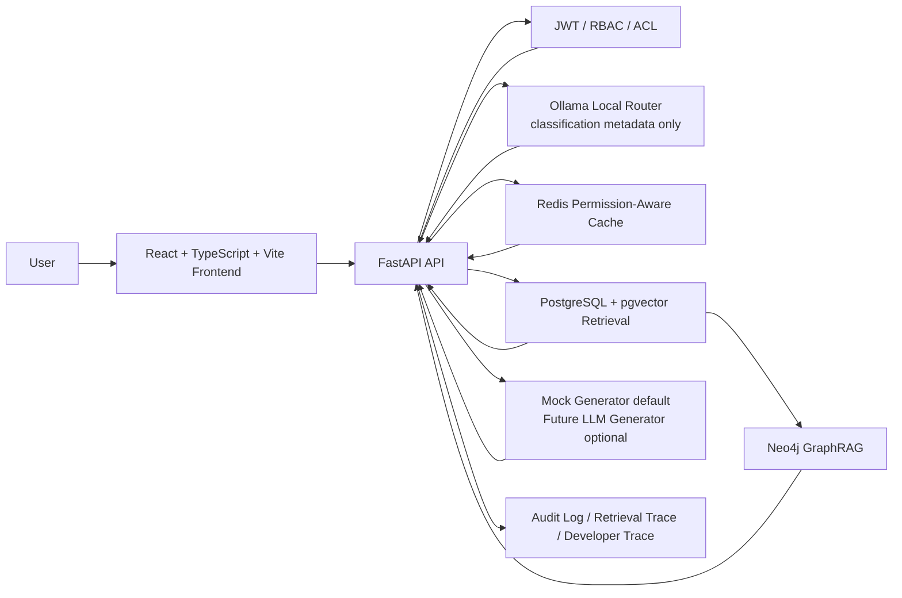

# Permission-Aware Enterprise GraphRAG Assistant

[](https://github.com/jimzhou03/permission-aware-enterprise-graphrag/actions/workflows/ci.yml)

Permission-Aware Enterprise GraphRAG Assistant is a local runnable enterprise knowledge assistant demo that combines JWT/RBAC, permission-scoped RAG retrieval, PostgreSQL + pgvector, Redis caching, Neo4j GraphRAG visualization, document upload/re-indexing, optional Ollama local routing, and auditable retrieval traces.

Current demo scenario (v0.7.2) uses a fictional company: **星海智造机器人有限公司 (StarSea Robotics Co., Ltd.)**.  
The company provides service robots, inspection robots, receptionist robots, and delivery robots for enterprises, schools, campuses, exhibition halls, and mixed-use business spaces.

## Why This Project

Enterprise knowledge systems are permission-sensitive by default:

- Internal knowledge bases usually contain role-restricted and department-restricted content.
- Naive RAG pipelines may retrieve unauthorized chunks before applying access control.
- Organizations need auditable retrieval behavior, role-based access, and safe model routing.
- LLMs should not decide permissions.
- Retrieval scope must be constrained before vector search.

This project focuses on deterministic backend authorization, then retrieval, then generation.

## Core Capabilities

- JWT authentication.
- RBAC and knowledge base ACL.
- Multi-department knowledge isolation with visitor/staff/admin scope boundaries.
- v0.7.2 three-layer knowledge base structure: `public-policy` + `company-internal` + `department-internal`.
- v0.7.2 router target scope narrowing before retrieval (`target_kb_codes` intersection with backend allowed scope).
- Permission-scoped pgvector SQL retrieval.
- Redis permission-aware cache and KB-version invalidation.
- Markdown/TXT document upload and re-indexing.
- Knowledge Base / Document / Chunk Viewer.
- Optional Ollama local router for lightweight intent classification (never permission authority).
- Backend-controlled function calling trace.
- Neo4j GraphRAG visualization.
- Audit logs and retrieval trace.
- Automated pytest and permission matrix validation script.

## Architecture



## Security Model

- Permissions are computed by deterministic backend code.
- `allowed_kb_ids` are resolved and enforced before retrieval.
- Router output can narrow retrieval to `target_kb_codes`, but permission authority remains backend RBAC/ACL.
- Frontend selection can only narrow scope; it cannot expand permissions.
- Ollama (when enabled) is only optional intent-routing assistance and safe fallback metadata.
- The final generator does not decide access control.
- Unauthorized chunks are excluded from answer payloads, trace payloads, cache usage paths, graph views, and audit payload outputs.
- Graph visualization endpoints are also permission-scoped.

## RAG Pipeline

1. Document upload.
2. Parse Markdown/TXT.
3. Chunking.
4. Embedding.
5. Store in PostgreSQL/pgvector-compatible schema.
6. Permission-scoped retrieval.
7. Answer generation.
8. Audit and trace persistence.

## Knowledge Base Layers

- `public-policy`: public/company introduction, open product line, external cooperation entry, visit guide, public contact.
- `company-internal`: internal organization/process handbook for formal employees only (visitor denied).
- `department-internal`: department-owned internal docs (`tech/sales/marketing/support/hr/admin/product`), each role sees only its own department plus allowed shared layers.

## GraphRAG Pipeline

1. PostgreSQL knowledge base / document / chunk data.
2. Neo4j graph sync.
3. Permission-scoped graph overview.
4. GraphRAG path viewer.
5. Developer Trace graph path inspection.

## Tech Stack

| Layer | Stack |
| --- | --- |
| Frontend | React + TypeScript + Vite + Tailwind |
| Backend | FastAPI + Pydantic + SQLAlchemy |
| Database | PostgreSQL + pgvector |
| Cache | Redis |
| Graph | Neo4j |
| Local model | Ollama `qwen2.5:0.5b-instruct` (router/classifier only) |
| Testing | `pytest` + permission matrix script |
| Deployment | Docker Compose |

## Quick Start

```bash
cd infra
docker compose build
docker compose up -d
curl http://localhost:8000/healthz
```

- Frontend: `http://localhost:5173`
- Swagger: `http://localhost:8000/docs`
- Neo4j Browser (local dev only): `http://127.0.0.1:7474`
- Adminer / PostgreSQL UI (local dev only): `http://127.0.0.1:8081`
- Redis Commander / Redis UI (local dev only): `http://127.0.0.1:8082`

## Local Observability Dev Tools (Local Development Only)

The following tools are for **local development observability only**.  
They are not production admin backends.

### Adminer (PostgreSQL UI)

- URL: `http://127.0.0.1:8081`
- System: `PostgreSQL`
- Server: `postgres`
- Username/Password/Database: read from `infra/.env` overrides (if set) or `infra/docker-compose.yml` defaults (`POSTGRES_USER`, `POSTGRES_PASSWORD`, `POSTGRES_DB`)

### Redis Commander (Redis UI)

- URL: `http://127.0.0.1:8082`
- Redis host: `redis`
- Redis port: `6379`
- Primary usage in this project: permission-aware cache inspection, KB version invalidation effect observation, temporary cache visibility

### Neo4j Browser

- URL: `http://127.0.0.1:7474`
- Bolt: `bolt://127.0.0.1:7687`
- Username/password: read from `infra/.env` overrides (if set) or `infra/docker-compose.yml` (`NEO4J_AUTH`, default `neo4j/password12345`)

Common Cypher examples:

```cypher
MATCH (n) RETURN n LIMIT 100;
```

```cypher
MATCH ()-[r]->() RETURN r LIMIT 100;
```

```cypher
MATCH (kb:KnowledgeBase) RETURN kb LIMIT 50;
MATCH (doc:Document) RETURN doc LIMIT 50;
MATCH (c:Chunk) RETURN c LIMIT 50;
MATCH (e:Entity) RETURN e LIMIT 50;
```

```cypher
MATCH (c:Chunk {id: "<chunk_id>"})-[:MENTIONS]->(e:Entity)
OPTIONAL MATCH (e)-[:RELATED_TO]-(related:Entity)
RETURN c.id AS chunk_id, e.name AS entity, collect(DISTINCT related.name)[0..10] AS related_entities;
```

Request-level graph note:

- Current Neo4j model does not persist `request_id` as a node.
- For request-level GraphRAG analysis: use `qa_audit_logs.hit_chunk_ids` (PostgreSQL) or `GET /api/v1/qa/{request_id}/trace`, then query those chunk IDs in Neo4j.

Detailed SQL / Redis CLI / Cypher cookbook: [docs/dev-observability.md](docs/dev-observability.md)

## Preconfigured Local Accounts

These are preconfigured **local demo accounts** for role-based walkthroughs.  
They are not production authentication credentials.

| Role | Email | Demo Password (Local) | Access Scope |
| --- | --- | --- | --- |
| `visitor` | `visitor@example.local` | one-click guest entry | `public-policy` only |
| `tech_staff` | `tech_staff@example.local` | `Passw0rd!123` | `public-policy`, `company-internal`, `tech-internal` |
| `sales_staff` | `sales_staff@example.local` | `Passw0rd!123` | `public-policy`, `company-internal`, `sales-internal` |
| `marketing_staff` | `marketing_staff@example.local` | `Passw0rd!123` | `public-policy`, `company-internal`, `marketing-internal` |
| `support_staff` | `support_staff@example.local` | `Passw0rd!123` | `public-policy`, `company-internal`, `support-internal` |
| `hr_staff` | `hr_staff@example.local` | `Passw0rd!123` | `public-policy`, `company-internal`, `hr-internal` |
| `admin_staff` | `admin_staff@example.local` | `Passw0rd!123` | `public-policy`, `company-internal`, `admin-internal` |
| `product_staff` | `product_staff@example.local` | `Passw0rd!123` | `public-policy`, `company-internal`, `product-internal` |
| `bilingual_admin` | `bilingual_admin@example.local` | `Passw0rd!123` | all demo knowledge bases + admin views |

## Demo Walkthrough

1. Start services:
   - `cd infra`
   - `docker compose up -d --build`
2. Login as `bilingual_admin@example.local`.
3. Open `Knowledge Bases` and inspect Knowledge Base / Document / Chunk viewers.
4. Send one department question in `Knowledge Chat`.
5. Open `Developer Trace` and inspect retrieval/function trace steps.
6. Open `GraphRAG` page and inspect graph overview/path view.
7. Open `Audit Logs` and locate the latest `request_id`.
8. Switch `visitor` / `tech_staff` / `sales_staff` / `marketing_staff` / `support_staff` / `hr_staff` / `admin_staff` / `product_staff` to validate isolation behavior.
9. Open Adminer (`http://127.0.0.1:8081`) to inspect PostgreSQL tables and rows.
10. Open Neo4j Browser (`http://127.0.0.1:7474`) to inspect graph nodes/relationships.
11. Open Redis Commander (`http://127.0.0.1:8082`) to inspect permission-aware cache keys and TTL.

## Automated Tests

```bash
cd apps/web
npm run build
```

```bash
cd infra
docker compose exec -T api python -m pytest -q
```

```bash
cd ..
python scripts/test_permission_matrix.py --base-url http://127.0.0.1:8000
```

The permission matrix script validates cross-role access boundaries, knowledge-base isolation, and overreach denial.

## Automated Quality Gates

GitHub Actions workflow [`.github/workflows/ci.yml`](.github/workflows/ci.yml) enforces automated quality gates for every `push` and `pull_request` to `main`:

- Frontend build (`apps/web`, `npm run build`).
- Backend pytest (`docker compose exec -T api python -m pytest -q`).
- Permission-aware access matrix (`python scripts/test_permission_matrix.py --base-url http://127.0.0.1:8000`).

These checks keep the current project posture unchanged: `LLM_MODE=mock` default, no external LLM API as default generator path, and no MCP dependency in CI.

## Real Embedding + Real LLM Generator (Optional Local Runtime)

Default runtime remains mock-first for stability:

- `EMBEDDING_MODE=mock`
- `LLM_MODE=mock`

This keeps CI and automated tests independent from external model services.

To enable real local embedding + generation in local development:

1. Edit root `.env` (do not commit secrets).
2. Set embedding mode:
   - `EMBEDDING_MODE=local`
   - `LOCAL_EMBEDDING_BACKEND=ollama` (recommended lightweight path) or `sentence-transformers`
   - `LOCAL_EMBEDDING_MODEL=nomic-embed-text` (ollama example)
3. Set generator mode:
   - `LLM_MODE=ollama` for local Ollama generation, or
   - `LLM_MODE=openai-compatible` for OpenAI-compatible API endpoint.
4. Keep router scope unchanged:
   - `LOCAL_ROUTER_MODE=rules|ollama` is optional intent-routing assistance only and does not decide permissions.
5. Rebuild API container and re-index data for embedding consistency when switching embedding mode/model.

Example local Ollama setup:

```bash
ollama pull nomic-embed-text
ollama pull qwen2.5:7b-instruct
```

```bash
# .env example
EMBEDDING_MODE=local
LOCAL_EMBEDDING_BACKEND=ollama
LOCAL_EMBEDDING_MODEL=nomic-embed-text
LOCAL_EMBEDDING_BASE_URL=http://host.docker.internal:11434

LLM_MODE=ollama
LLM_OLLAMA_BASE_URL=http://host.docker.internal:11434
LLM_OLLAMA_MODEL=qwen2.5:7b-instruct
```

Security and scope guarantees remain unchanged in real generator mode:

- Backend deterministic RBAC resolves `allowed_kb_ids` first.
- Retrieval runs only in authorized KB scope.
- Generator receives only authorized retrieved chunks/citations.
- Unauthorized chunks are excluded from prompt/answer/trace/cache/audit/graph outputs.

## Current Scope

- Final answer generator defaults to `LLM_MODE=mock`.
- Ollama local router is optional and classification-only.
- Markdown/TXT upload is supported.
- PDF/DOCX ingestion is planned.
- MCP integration is planned.
- Production hardening is planned.
- Alembic migrations are planned.
- This repository is a local runnable engineering showcase for a fictional company demo, not production-ready and not a hosted SaaS product.

## Roadmap

- Extend CI with additional static/security checks.
- Real embedding model integration.
- Real LLM generator integration.
- PDF/DOCX ingestion.
- User/role/permission admin panel.
- Production hardening.
- MCP adapter.

## Screenshots

- TODO: Login and role selection.
- TODO: Knowledge Chat.
- TODO: Knowledge Base / Chunk Viewer.
- TODO: Upload and re-indexing.
- TODO: Developer Trace.
- TODO: GraphRAG visualization.

## Project Status

For implementation and release status, see [docs/PROJECT_STATUS.md](docs/PROJECT_STATUS.md).
