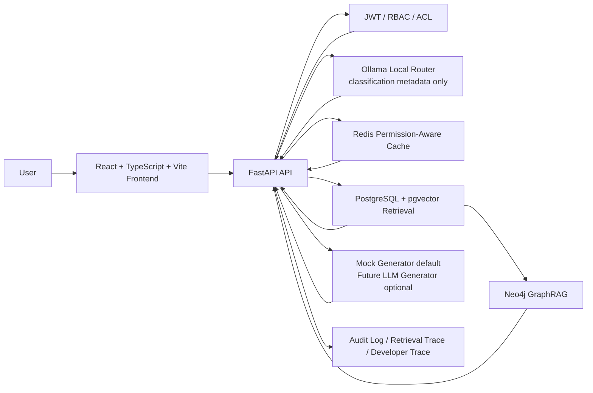

# Permission-Aware Enterprise GraphRAG Assistant

Permission-Aware Enterprise GraphRAG Assistant is a full-stack enterprise AI knowledge assistant that combines JWT/RBAC, permission-scoped RAG retrieval, PostgreSQL + pgvector, Redis caching, Neo4j GraphRAG visualization, document upload/re-indexing, Ollama local routing, and auditable retrieval traces.

This repository is a local runnable full-stack implementation and engineering showcase with production-inspired architecture and explicit security boundaries.

## Why This Project

Enterprise knowledge systems are permission-sensitive by default:

- Internal knowledge bases usually contain role-restricted and department-restricted content.
- Naive RAG pipelines may retrieve unauthorized chunks before applying access control.
- Organizations need auditable retrieval behavior, role-based access, and safe model routing.
- LLMs should not decide permissions.
- Retrieval scope must be constrained before vector search.

This project focuses on deterministic backend authorization, then retrieval, then generation.

## Core Capabilities

- JWT authentication.
- RBAC and knowledge base ACL.
- Bilingual department knowledge isolation.
- Permission-scoped pgvector SQL retrieval.
- Redis permission-aware cache and KB-version invalidation.
- Markdown/TXT document upload and re-indexing.
- Knowledge Base / Document / Chunk Viewer.
- Ollama local router for lightweight classification.
- Backend-controlled function calling trace.
- Neo4j GraphRAG visualization.
- Audit logs and retrieval trace.
- Automated pytest and permission matrix validation script.

## Architecture



## Security Model

- Permissions are computed by deterministic backend code.
- `allowed_kb_ids` are resolved and enforced before retrieval.
- Frontend selection can only narrow scope; it cannot expand permissions.
- Ollama is used only to classify routing metadata.
- The final generator does not decide access control.
- Unauthorized chunks are excluded from answer payloads, trace payloads, cache usage paths, graph views, and audit payload outputs.
- Graph visualization endpoints are also permission-scoped.

## RAG Pipeline

1. Document upload.
2. Parse Markdown/TXT.
3. Chunking.
4. Embedding.
5. Store in PostgreSQL/pgvector-compatible schema.
6. Permission-scoped retrieval.
7. Answer generation.
8. Audit and trace persistence.

## GraphRAG Pipeline

1. PostgreSQL knowledge base / document / chunk data.
2. Neo4j graph sync.
3. Permission-scoped graph overview.
4. GraphRAG path viewer.
5. Developer Trace graph path inspection.

## Tech Stack

| Layer | Stack |
| --- | --- |
| Frontend | React + TypeScript + Vite + Tailwind |
| Backend | FastAPI + Pydantic + SQLAlchemy |
| Database | PostgreSQL + pgvector |
| Cache | Redis |
| Graph | Neo4j |
| Local model | Ollama `qwen2.5:0.5b-instruct` (router/classifier only) |
| Testing | `pytest` + permission matrix script |
| Deployment | Docker Compose |

## Quick Start

```bash
cd infra
docker compose build
docker compose up -d
curl http://localhost:8000/healthz
```

- Frontend: `http://localhost:5173`
- Swagger: `http://localhost:8000/docs`

## Preconfigured Local Accounts

These are preconfigured local accounts for local validation and role-based walkthrough.

| Role | Email | Password | Access Scope |
| --- | --- | --- | --- |
| `bilingual_admin` | [bilingual_admin@example.local](mailto:bilingual_admin@example.local) | `Passw0rd!123` | all bilingual and public knowledge bases |
| `cn_staff` | [cn_staff@example.local](mailto:cn_staff@example.local) | `Passw0rd!123` | `cn-public` and `cn-internal` |
| `en_staff` | [en_staff@example.local](mailto:en_staff@example.local) | `Passw0rd!123` | `en-public` and `en-internal` |
| `visitor` | [visitor@example.local](mailto:visitor@example.local) | `Passw0rd!123` | `public-policy` only |

## Automated Tests

```bash
cd apps/web
npm run build
```

```bash
cd infra
docker compose exec -T api python -m pytest -q
```

```bash
cd ..
python scripts/test_permission_matrix.py --base-url http://127.0.0.1:8000
```

The permission matrix script validates cross-role access boundaries, knowledge-base isolation, and overreach denial.

## Current Scope

- Final answer generator defaults to `LLM_MODE=mock`.
- Ollama is router/classifier only.
- Markdown/TXT upload is supported.
- PDF/DOCX ingestion is planned.
- MCP integration is planned.
- Production hardening is planned.
- Alembic migrations are planned.
- This repository is a local runnable full-stack implementation and engineering showcase, not a hosted SaaS product.

## Roadmap

- GitHub Actions CI.
- Real embedding model integration.
- Real LLM generator integration.
- PDF/DOCX ingestion.
- User/role/permission admin panel.
- Production hardening.
- MCP adapter.

## Screenshots

- TODO: Login and role selection.
- TODO: Knowledge Chat.
- TODO: Knowledge Base / Chunk Viewer.
- TODO: Upload and re-indexing.
- TODO: Developer Trace.
- TODO: GraphRAG visualization.

## Project Status

For implementation and release status, see [docs/PROJECT_STATUS.md](docs/PROJECT_STATUS.md).
