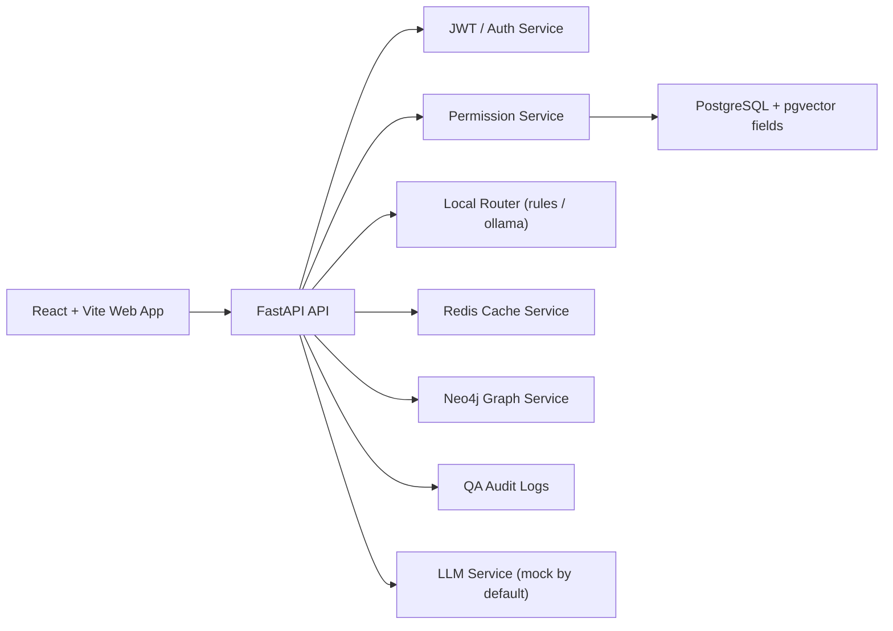

# Permission-Aware Enterprise GraphRAG Assistant

A permission-first internal knowledge assistant that enforces backend RBAC and scoped RAG retrieval before answer generation.

## Feature Overview

- JWT login with role and department claims.
- Deterministic backend permission enforcement (`RBAC + KnowledgeBase ACL`).
- Permission-aware RAG retrieval with knowledge base scope filtering.
- Real pgvector SQL retrieval path for PostgreSQL deployments (with safe fallback).
- Ollama local router (qwen2.5:0.5b-instruct) for lightweight classification with safe fallback to rules.
- Knowledge Base Viewer + Document Viewer + Chunk Viewer (read-only, permission-scoped).
- Retrieval Trace API and Developer Trace page for `request_id`, scope, chunk hits, deny/cache path.
- GraphRAG scaffolding with Neo4j entity/path projection.
- Permission-aware cache key design with `cache_hit` audit visibility.
- Audit logging for every QA request.
- Bilingual UI (Chinese/English) with product-style workspace navigation.

## Architecture



## Permission Model

- `visitor`: `public-policy`
- `cn_staff`: `cn-public`, `cn-internal`
- `en_staff`: `en-public`, `en-internal`
- `bilingual_admin`: `cn-public`, `cn-internal`, `en-public`, `en-internal`, `public-policy`

Permission boundary is backend-owned:

1. JWT identity is resolved server-side.
2. Backend calculates allowed scope (`allowed_kb_ids`).
3. Requested KB scope is validated against allowed scope.
4. Retrieval only runs inside authorized KBs.
5. Overreach requests are denied and audited.

## RAG Retrieval Flow

1. Receive question and mode (`auto/rag/graphrag`).
2. Route/classify question (`LOCAL_ROUTER_MODE=rules|ollama`).
3. Resolve backend permission scope.
4. Validate optional frontend KB selection against scope.
5. Retrieve chunks only from authorized KBs.
6. Optionally project graph evidence paths (GraphRAG mode).
7. Generate final answer (`LLM_MODE=mock` by default).
8. Persist audit record and cache payload.

Retrieval engine behavior:

- PostgreSQL + pgvector available/enabled: `pgvector_sql`
- SQLite or pgvector unavailable/disabled: `python_cosine_fallback`

In both modes, retrieval is scoped in backend by `allowed_kb_ids` before any chunk is returned.

Router behavior:

- `LOCAL_ROUTER_MODE=rules` (default): deterministic rules router.
- `LOCAL_ROUTER_MODE=ollama`: calls local Ollama model for classification only.
- If Ollama is unavailable/timeout/invalid-output, router safely falls back to rules.
- Router never decides permission and never expands `allowed_kb_ids`.

## Observability Endpoints (v0.2.1)

- `GET /api/v1/knowledge-bases`:
  Returns knowledge bases visible to the current user, including `display_name`, `language`, and scoped metadata.
- `GET /api/v1/knowledge-bases/{kb_id}/documents`:
  Returns documents in a knowledge base only when the caller has access to that KB.
- `GET /api/v1/documents/{document_id}/chunks`:
  Returns chunk list with preview/full content and embedding status only when the caller can access the document's KB.
- `GET /api/v1/qa/{request_id}/trace`:
  Returns structured retrieval trace. Includes router metadata (`router_mode`, `router_model`, fallback/error, router decision). Chunk content is filtered again by the current viewer's permission scope.
- `GET /api/v1/system/retrieval-config`:
  Returns safe runtime config for retrieval mode, router runtime, and embedding mode.

## Demo Accounts

| Role | Email | Password |
| --- | --- | --- |
| `bilingual_admin` | `bilingual_admin@example.local` | `Passw0rd!123` |
| `cn_staff` | `cn_staff@example.local` | `Passw0rd!123` |
| `en_staff` | `en_staff@example.local` | `Passw0rd!123` |
| `visitor` | `visitor@example.local` | `Passw0rd!123` |

## Quick Start

### Docker Compose

```powershell
Copy-Item .env.example .env
Set-Location infra
docker compose up -d --build
```

Endpoints:

- Web: `http://127.0.0.1:5173`
- API docs: `http://127.0.0.1:8000/docs`
- Neo4j Browser: `http://127.0.0.1:7474`

### Local Development

Backend:

```powershell
Set-Location services/api
python -m venv .venv
.\.venv\Scripts\Activate.ps1
python -m pip install -r requirements.txt
python main.py
```

Frontend:

```powershell
Set-Location apps/web
npm install
npm run dev
```

### Enable Ollama Router (optional)

Run Ollama locally:

```powershell
ollama run qwen2.5:0.5b-instruct
```

Set environment:

```powershell
LOCAL_ROUTER_MODE=ollama
OLLAMA_BASE_URL=http://host.docker.internal:11434
OLLAMA_ROUTER_MODEL=qwen2.5:0.5b-instruct
OLLAMA_ROUTER_TIMEOUT_SECONDS=8
```

For non-Docker local API runtime, `OLLAMA_BASE_URL=http://127.0.0.1:11434` also works.

## Test Commands

```powershell
# backend unit tests
Set-Location services/api
.\.venv\Scripts\python -m pytest

# permission matrix smoke test
Set-Location C:\Users\lovane\Desktop\permission-aware-enterprise-graphrag
.\services\api\.venv\Scripts\python scripts\test_permission_matrix.py --base-url http://127.0.0.1:8000

# frontend build
Set-Location apps/web
npm run build
```

## Current Limitations

- `LLM_MODE=mock` by default (deterministic mock generation path).
- Embedding is deterministic mock embedding in MVP (`SHA256`-based vector projection).
- Document upload/indexing management API is not implemented yet.
- Ollama is used only as local router/classifier in v0.2.1; it is not the final answer generator.
- External LLM API mode exists but is disabled by default.

## Roadmap

- Admin knowledge base viewer polish.
- Real document upload and indexing pipeline.
- Function calling trace and tool-call observability.
- MCP adapter layer.
- Production deployment hardening (security, ops, reliability).

## Security Notes

- Do not commit real secrets or `.env`.
- Use fictional sample data only.
- Keep authorization decisions on backend services, never in frontend logic.
