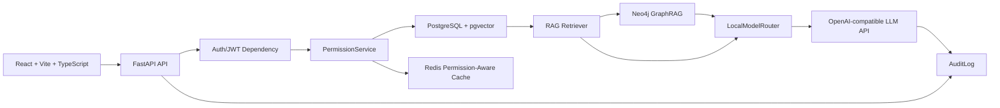

# Architecture

## 1. 总体架构

## 2. 请求链路

1. React前端携带JWT调用后端API。
2. FastAPI通过Auth依赖解析JWT。
3. PermissionService读取用户、角色、部门、知识库ACL。
4. 后端计算 `allowed_kb_ids` 和 `permission_scope_hash`。
5. Redis先使用权限感知key查询缓存。
6. 缓存未命中时，Retriever只在授权知识库内检索。
7. GraphRAG只基于授权chunk和授权document扩展图谱。
8. PromptBuilder只拼接授权上下文。
9. LLM API生成最终回答。
10. AuditLog记录请求、命中、拒绝和缓存信息。

## 3. 模块职责

| 模块 | 职责 |
| --- | --- |
| React Web | 登录、知识库列表、问答、审计日志、越权演示 |
| FastAPI | API入口、鉴权依赖、请求校验、服务编排 |
| PermissionService | 唯一权限判断来源 |
| RAG Retriever | 基于pgvector执行权限范围内向量召回 |
| GraphRAG Service | 在Neo4j中扩展授权文档关联实体和路径 |
| CacheService | 构造权限感知缓存key，读写Redis |
| LocalModelRouter | 判断意图、部门路由、是否需要RAG/GraphRAG |
| LLMClient | 调用OpenAI-compatible高参数模型生成答案 |
| AuditService | 写入所有问答和拒绝事件 |

## 4. 数据边界

- PostgreSQL是权限事实源。
- Neo4j不决定权限，只提供图谱扩展。
- Redis不作为权限来源，只缓存已授权结果。
- LLM不决定用户是否有权限。
- 前端不可信，不能依赖前端传入的角色或知识库范围做授权。

## 5. 部署边界

MVP推荐Docker Compose本地部署：

- `web`：React静态应用或Vite开发服务。
- `api`：FastAPI服务。
- `postgres`：主数据库，启用pgvector。
- `redis`：缓存层。
- `neo4j`：图数据库。

