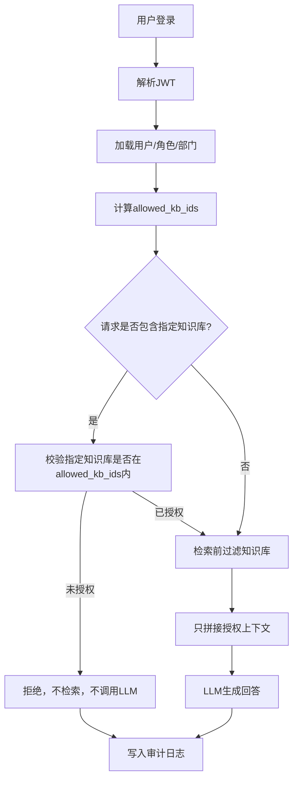

# Security Design

## 1. 安全原则

- 权限判断必须由后端确定性代码完成。
- 大模型不能决定用户是否有权限。
- 未授权文档不能进入RAG召回结果。
- 缓存不能让不同权限用户共享敏感答案。
- 所有问答请求都要审计，包括拒绝请求和缓存命中请求。
- 示例数据必须是虚构数据。
- 不提交真实密钥、真实企业文档或真实用户数据。

## 2. 权限控制流程



## 3. RBAC和部门权限

权限范围由以下因素共同决定：

- 用户角色：`admin`、`hr`、`finance`、`tech`、`visitor`。
- 用户部门：`hr`、`finance`、`tech`、`public`。
- 知识库可见性：`public` 或 `private`。
- 知识库ACL：角色、部门和访问级别。
- 权限策略版本：例如 `rbac-v1`。

## 4. RAG防越权

正确做法：

```sql
SELECT *
FROM document_chunks
WHERE knowledge_base_id IN (:allowed_kb_ids)
ORDER BY embedding <=> :query_embedding
LIMIT :top_k;
```

禁止做法：

```text
先全量向量召回，再让LLM判断哪些文档能看。
```

原因：

- 全量召回可能把未授权内容暴露给prompt。
- LLM不是安全边界。
- 即使最终回答不展示，prompt和日志也可能泄露敏感内容。

## 5. GraphRAG防越权

GraphRAG查询必须从授权chunk或授权document出发：

- 起点必须来自 `allowed_kb_ids` 范围内的RAG候选。
- Neo4j扩展时必须带 `knowledge_base_id` 或 `document_id` 约束。
- 图谱路径只作为授权上下文的补充证据。
- 禁止在全图中直接按实体名扩展后再过滤。

## 6. Redis缓存安全

缓存key必须包含：

- `user_id`
- `role`
- `department`
- `permission_scope_hash`
- `kb_version_hash`
- `question_hash`
- `mode`
- `model_profile`
- `prompt_version`

推荐结构：

```text
qa:v1:{user_id}:{role}:{department}:{permission_scope_hash}:{kb_version_hash}:{question_hash}:{mode}:{model_profile}:{prompt_version}
```

风险示例：

- 如果只按 `question_hash` 缓存，`finance` 的财务答案可能被 `visitor` 命中。
- 如果不包含 `kb_version_hash`，知识库更新后可能返回旧答案。
- 如果不包含 `permission_scope_hash`，同角色不同授权范围可能串缓存。

## 7. 审计日志

审计日志至少记录：

- 请求ID。
- 用户ID。
- 用户角色和部门快照。
- 问题原文。
- 是否拒绝。
- 拒绝原因。
- 命中知识库。
- 命中文档。
- 命中chunk。
- 是否缓存命中。
- 使用的检索模式。
- 使用的模型。
- 请求耗时。
- 创建时间。

## 8. 密钥和数据安全

- `.env`、`.env.*` 不进入Git。
- `.env.example` 只保留示例变量。
- API Key不得硬编码。
- 示例文档只能使用虚构企业内容。
- `data/`、`volumes/`、`models/` 等本地运行目录不进入Git。

